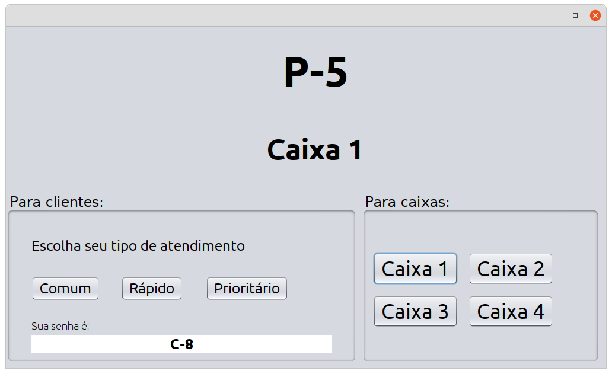

## 🚀 Atividade

A Orientação a Objetos está presente em diversos programas que utilizamos em nosso cotidiano. Muitas vezes, nem a percebermos. Você viu no estudo da disciplina Programação II que podemos modelar diversos problemas em termos de classes e objetos.
Nesta Atividade Mapa, você deve desenvolver um sistema de controle de filas de um banco fictício utilizando a linguagem Java. Considere que neste banco há apenas uma agência e, esta agência, possui 4 caixas de atendimento.
 

Os atendimentos a clientes podem ser divididos em 3 categorias:

- Preferencial: para pessoas que possuem atendimento prioritário assegurado por lei;
- Rápido: para pessoas que farão até 3 operações no caixa;
- Comum: para os demais atendimentos.

O trabalho que você deve desenvolver terá 3 etapas:

1. Construção da interface, de acordo com o modelo abaixo. Não precisa ficar igual, mas precisa ter os mesmos elementos.

2. Criação da fila de atendimento.

Semelhante às máquinas de geração de senhas, há três botões para os clientes: Preferencial, Rápido e Comum. O cliente aperta o botão de acordo com o seu atendimento, sua senha é gerada e colocada em uma fila.

A senha deve ter a letra do tipo do atendimento (P, R ou C), seguida de um número sequencial. A sequência é a mesma para os diferentes tipos.

Por exemplo, se chegarem 4 clientes, 1 sendo preferencial, 2 comuns e 1 atendimento rápido, nesta ordem, a fila será:

P-1, C-2, C-3, R-4.

Haverá uma única fila que será implementada com ArrayList, contendo todas as senhas geradas, que serão objetos da classe Senha, que você irá criar.
A classe senha precisa apenas de dois atributos: o tipo e o número.

3. Realização dos atendimentos.

Haverá 4 caixas para atendimentos, que atenderão da seguinte forma:

- Caixa 1: realiza os atendimentos preferenciais. Se não houver atendimentos preferenciais na fila, atende o próximo (rápido ou comum).
- Caixas 2 e 3: atendem primeiro as senhas de atendimento rápido. Se não houver atendimento rápido, atendem o próximo da fila (prioritário ou comum).
- Caixa 4: realiza os atendimentos comum. Se não houver atendimentos comuns na fila, atende o próximo (rápido ou prioritário).

Cada caixa, tem o seu botão. Ao clicar no seu respectivo botão, este, deverá buscar a próxima senha a ser atendida. Na sequência, deverá exibir no painel a senha e o caixa. Por fim, o caixa deverá retirar a senha da fila. Se não houver nenhuma senha na fila, não faz nada.

---

# 📚 O que eu aprendi com o projeto!

- Criar interfaces utilizando Swing GUI ;
- Chamar métodos atráves de interações com JButton;

# 💻 Tecnologias

<a href='https://www.oracle.com/java/technologies/'>Java</a>
 
<a href='https://netbeans.org/'>NetBeans</a>
 

# 📝 Sobre o projeto

Este é um projeto acadêmico. Seu principal objetivo é facilitar a avaliação dos professores.

---

O aprendizado é contínuo e o próximo nível nunca será o último 🚀 by [aalvs](https://app.rocketseat.com.br/me/aalvs).